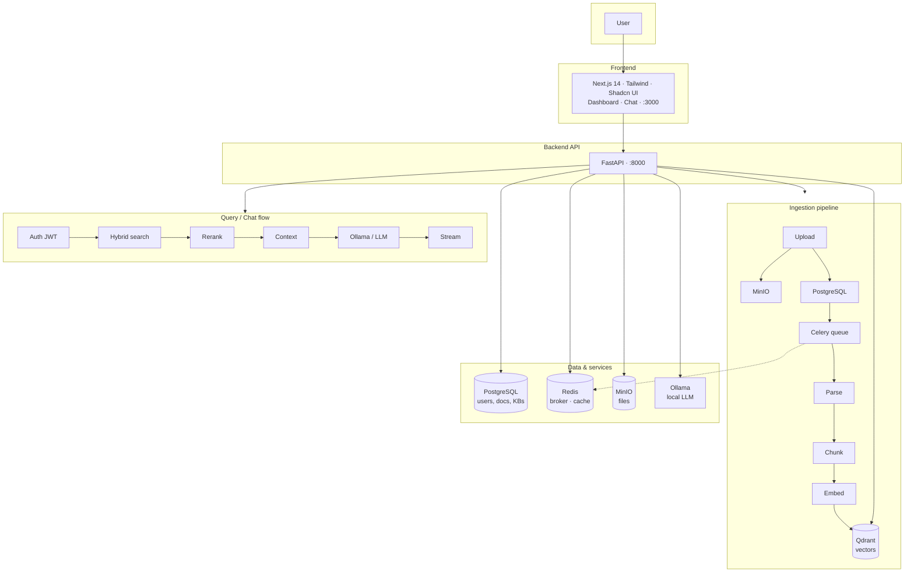
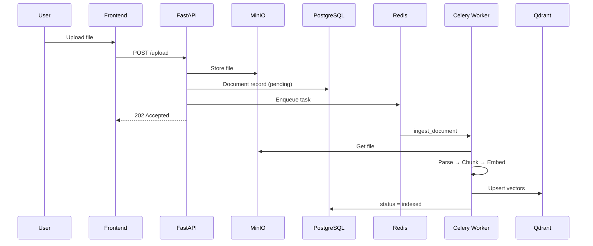
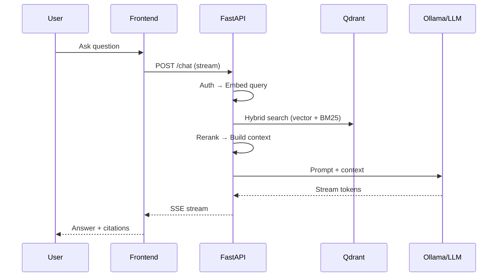

# Ragnetic — Visual Architecture

## System overview

## Containers (docker-compose)

| Service        | Port(s)  | Role                          |
|----------------|----------|-------------------------------|
| **frontend**   | 3000     | Next.js app                   |
| **backend**    | 8000     | FastAPI API                   |
| **celery_worker** | —     | Async ingestion tasks         |
| **celery_flower** | 5555   | Task monitoring               |
| **db**         | 5432     | PostgreSQL                    |
| **qdrant**     | 6333–6334| Vector store                  |
| **redis**      | 6379     | Celery broker + cache         |
| **minio**      | 9000, 9001 | Object storage + console   |
| **ollama**     | 11434    | Local LLM                     |

## Ingestion flow (simplified)

## Query / Chat flow (simplified)

